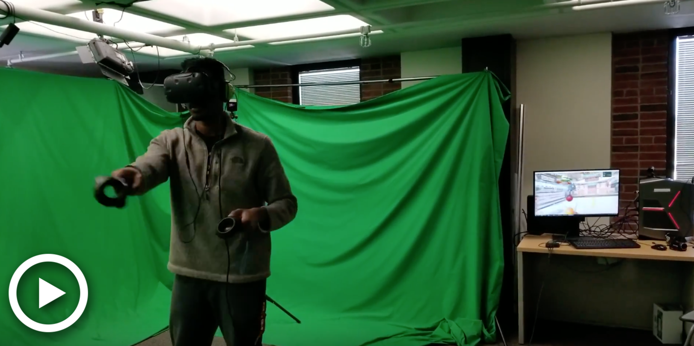
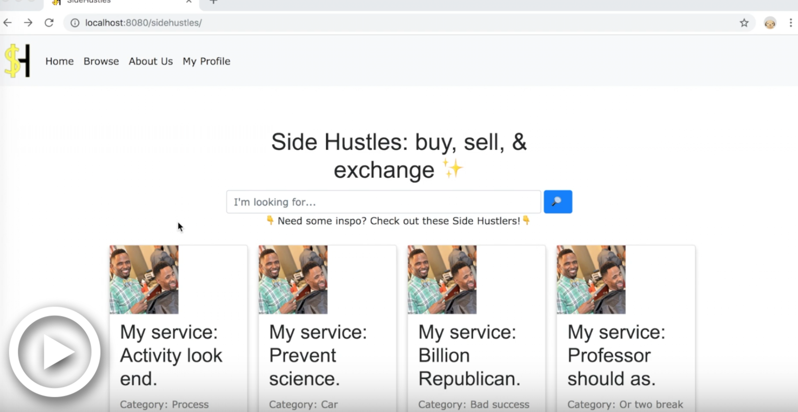
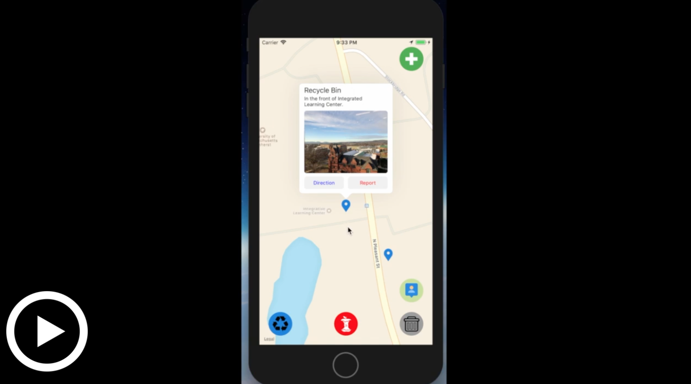

# **VR Exergaming vs. Traditional Physical Activity**
###### **Status**: In progress 🚧

***

####  Study Background 
 *  It is commonly known that physical activity (PA) is beneficial to health. Unfortunately, despite the apparent benefits, preventing sedentary behaviors from taking root is not universally feasible for all people.

 * 
 
Fortunately, alternative options are increasingly being developed. A burgeoning option is virtual reality (VR) exergaming i.e. gamified exercising, that is often conducted with VR and/or modified exercise equipment. It can be done in short bouts at the user’s convenience and the necessary technology is widely available.
 

 

*  Research has shown that exergaming is a viable means of reaching PA intensities recommended by public health authorities in college students (Siegel, Haddock, Dubois, and Wilkin, 2009). As an intervention tool, research has also demonstrated that exergaming can promote PA adherence and improve chronic disease markers among young college-aged males over 6 weeks (Warburton et al., 2007). 
*  These benefits are particularly relevant to college students and their highly structured lives. In their pursuit to obtain PA, exergaming has the potential to fit their tight schedules and fulfill their PA needs.

####  Honors Thesis Purpose & Implications 
*  VR exergaming appeals to video game enthusiasts, VR users and laypeople who are increasingly exposed to the technology. More importantly, among these people, VR exergaming has the potential to positively impact college students as well. By analyzing quantitative step count and intensity differences between VR exergaming and traditional PA, the study will objectively provide insight about how the two types of PA compare. 

*  To do this, the study will pair three VR exergaming activities and three traditional PA exercises using metabolic equivalent (MET) values. The activities will be compared using step count and step intensity. These metrics will be recorded using an <a href=https://www.actigraphcorp.com/support/activity-monitors/gt9x-link/>ActiGraph GT9X</a>, a wearable accelerometer and pedometer.

*  Furthermore, the study will help to inform what type of PA is feasible given the constraints of an academic schedule. After the study has ended, it is meaningful to know if participants would continue the types of PA in question (VR exergaming or traditional PA) if they had the opportunity to do so. As a result, the study will also provide insight about PA adherence beyond the study via qualitative data collection. 

*  The target demographic for this study consists of college students between 18 and 23 years of age at the University of Massachusetts Amherst. The study is not looking for a particular student in this age range. Ultimately, no matter who the student is, it is valuable to be aware of PA alternatives. This knowledge would benefit students in their effort to incorporate some form PA in their schedules at school and beyond. 

* 

 This study would not be possible without the guidance, supervision, and support of <a href=https://www.umass.edu/sphhs/person/faculty/catrine-tudor-locke>Dr. Catrine Tudor-Locke</a>, Professor and Associate Dean for Research and Administration in the Kinesiology Department at UMass Amherst. I am conducting this honors thesis in the framework of her year-long course, Wearable Technologies in Physical Activity and Health. In April 2019, my honors thesis will be presented at the annual <a href=https://www.honors.umass.edu/massurc>Undergraduate Research Conference (MassURC)</a>. Thank you, Dr. Tudor-Locke!

***

####  Presentation Slide Deck 
* <a href="documents/Edwood_Brice_499E_Presentation.pdf" download>Step Count and Intensity in Virtual Reality Exergaming and Traditional Physical Activity</a>

####  #MyHonorsThesis: Overview Video 

 This video was submitted to the UMass Commonwealth Honors College <a href=https://www.honors.umass.edu/news/myhonorsthesis-video-contest>#MyHonorsThesis</a> contest and was selected as one of the three winning entries. Entrants were required to describe their honors thesis in 45 seconds or less. 

***

####  References 

Peterson, S. M., Furuichi, E., & Ferris, D. P. (2018). Effects of virtual reality high heights exposure during beam-walking on physiological stress and cognitive loading. PLoS ONE, 13(7), e0200306. http://doi.org/10.1371/journal.pone.0200306

Siegel, S. R., L.Haddock, B., Dubois, A. M., & Wilkin, L. D. (2009). Active Video/Arcade Games (Exergaming) and Energy Expenditure in College Students. International Journal of Exercise Science, 2(3), 165–174.

Warburton, D. E., Bredin, S. S., Horita, L. T., Zbogar, D., Scott, J. M., Esch, B. T., & 		Rhodes, R.E. (2007). The health benefits of interactive video game exercise. Applied Physiology, Nutrition, and Metabolism,32(4), 655-663. doi:10.1139/h07-038

***

# **Side Hustles**
###### **Status**: Completed ✅

***
####  Application Background 
* 

Side Hustles was built in collaboration with four other peers for a web programming course (Fall 2018). It matches “buyers” to “sellers”. With Side Hustles, each seller on the platform will have the opportunity to offer services (like a haircut) **OR** a physical product (such as a textbook) for monetary currency or something bartered. 

*  For the current iteration, potential users---buyers and sellers---are limited to students from UMass. When buyers select a seller to patronize, they “match” with that person i.e. they find their Side Hustle Match. 

*  The application was inspired by Etsy and Amazon. The salient components of each e.g. the amateur  marketplace fostered by Etsy and the intuitive and accessible UI of Amazon, were merged to create something unique that focuses on college students. 

***

####  Languages & Skills {.tabset}

##### Python
The <a href=https://www.djangoproject.com/>Django web framework</a> was used to implement this project. I was responsible for:

* getting images throughout the application to render
* implementing forms that post and save data to the application's database
* contributing to user authentication via forms 
* general application debugging

##### SQLite
The Django web framework has SQLite built in. I contributed to the data model that enabled Side Hustles to read and write data.

##### HTML & CSS
Side Hustles primarily makes use of the Bootstrap and W3 Schools libraries to style the pages. I was responsible for designing and styling the application's landing page.

***

####  Application Pitch Slide Deck 
* <a href="documents/Pitch_Party_Slide_Deck.pdf" download>Side Hustles - Team J: Jellyworks</a>

####  Overview Video Playlist 

***

# **QuickBin**
######  **Status**: Completed ✅

***

####  Application Background
*  QuickBin maps receptacles (recycling, composting, and trash) and provides users with directions to them using Apple Maps integration.
*  It was built in collaboration with three other peers for a human-computer interaction course (Fall 2018). With QuickBin, we wanted to foster sustainable behaviors and reduce the level of littering that we observed on the UMass Amherst campus. 
*  As a result, we made use of a human-centered design approach that continuously incorporated user feedback and suggestions. Our target demographic consisted of freshmen, transfer students, professors, and campus visitors because they are likely to be unaware of campus receptacle locations.
* 

For the current version, QuickBin's goals are to:
    (1) let users know where the receptacles are  
    (2) provide directions to show users how to get them. 

***

#### Languages & Skills {.tabset}

##### UX/UI Design
QuickBin makes use of a human-centered design approach. As a result, the application went through several iterations that were inspired by comments, suggestions, and difficulties conveyed by the target demographic and their experiences with QuickBin. To ensure that the end user was involved every step of the way, I contributed to data collection that provided salient insight for implementing the app. I also designed QuickBin's layout and icons with the goals of maximizing simplicity and accessibility in mind. This resulted in favorable results with end users when they tested the last few iterations of QuickBin.

##### Swift & Xcode
QuickBin was written in Swift using Xcode. I was responsible for writing the error messages that users encounter throughout the application. Additionally, Xcode was used to simulate the application to ensure that it was intuitive and functional for the target demographic.

***

####  Application Pitch Slide Deck
* <a href="documents/325_Application_Pitch_Presentation.pdf" download>Saving the Environment with "QuickBin"</a>

#### Overview Video

