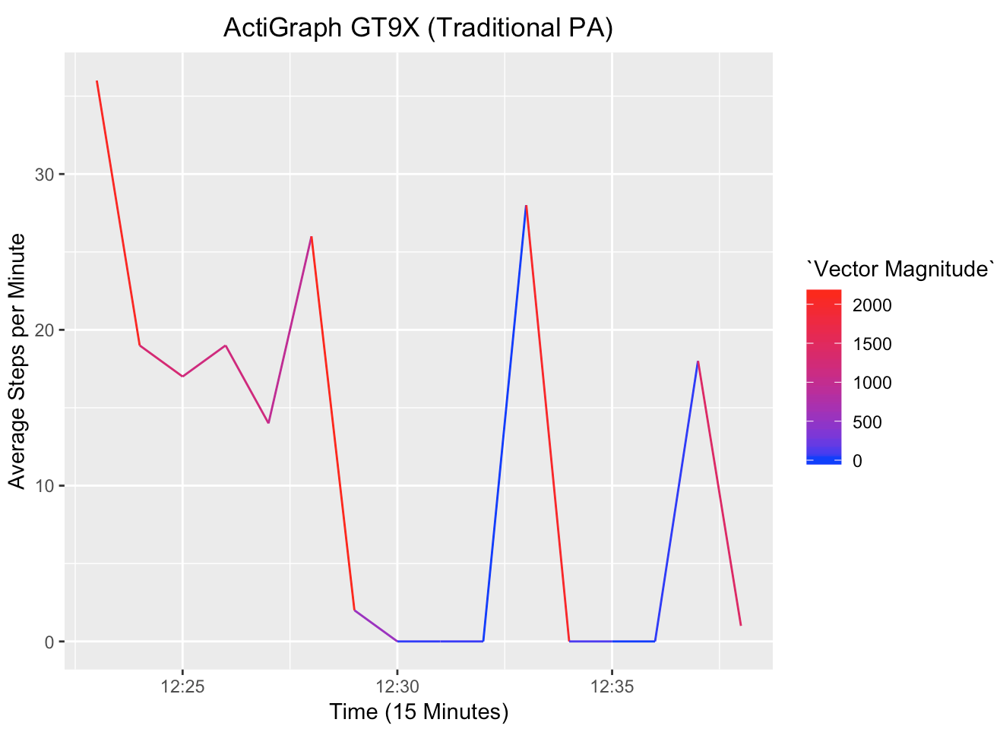

<style>
div.blue { background-color:#e6f0ff; 
border-radius: 5px; 
padding: 5px;}

div.card {
  box-shadow: 0 2px 4px 0 rgba(0, 0, 0, 0.2), 0 3px 10px 0 rgba(0, 0, 0, 0.19);
  padding-top: 30px;
  padding-right: 40px;
  padding-bottom: 15px;
  padding-left: 40px;
  border-radius: 10px;}
</style>


# <span style="color:maroon">VR Exergaming vs. Traditional Physical Activity</span>
<div class="card">
###### <span style="color:black">**Status**: Completed ✅</span>
<span>
My honors thesis was selected to receive a [UMass Commononwealth Honors College (CHC) Honors Dean's Award in March 2019](https://www.honors.umass.edu/scholarship/honors-deans-award). It was also a winning entry in the [CHC #MyHonorsThesis contest](https://www.honors.umass.edu/braggingwrites/and-myhonorsthesis-winners-are). In April 2019, my thesis was officially defended. Additionally, it was presented at the [Massachusetts Undergraduate Research Conference (MassURC)](https://www.honors.umass.edu/massurc) and the [UMass Research Art Exhibition (RASE)](https://rase.steveacquah.umasscreate.net/). </span>
</div>

<hr style="border: none;">

#### <span style="color:black"> Honors Thesis Overview </span> {.tabset .tabset-fade}
##### <span style="color:black"> Background </span>
 * <span style="color:black"> It is commonly known that physical activity (PA) is beneficial to health. Unfortunately, despite the apparent benefits, preventing sedentary behaviors from taking root is not universally feasible for all people.</span>

 * <span style="color:black">
 <div class = "blue">Fortunately, alternative options are increasingly being developed. A burgeoning option is virtual reality (VR) exergaming i.e. gamified exercising, that is often conducted with VR and/or modified exercise equipment. It can be done in short bouts at the user’s convenience and the necessary technology is widely available.
 </div>
 </span>

* <span style="color:black"> Research has shown that exergaming is a viable means of reaching PA intensities recommended by public health authorities in college students (Siegel, Haddock, Dubois, and Wilkin, 2009). As an intervention tool, research has also demonstrated that exergaming can promote PA adherence and improve chronic disease markers among young college-aged males over 6 weeks (Warburton et al., 2007). </span>
* <span style="color:black"> These benefits are particularly relevant to college students and their highly structured lives. In their pursuit to obtain PA, exergaming has the potential to fit their tight schedules and fulfill their PA needs.</span>

##### <span style="color:black"> Purpose & Implications </span>
* <span style="color:black"> VR exergaming appeals to video game enthusiasts, VR users and laypeople who are increasingly exposed to the technology. More importantly, among these people, VR exergaming has the potential to positively impact college students as well. By analyzing quantitative step count and intensity differences between VR exergaming and traditional PA, the study objectively provided insight about how the two types of PA compare. </span>

* <span style="color:black">
To do this, the study paired three VR exergaming activities and three traditional PA exercises using metabolic equivalent (MET) values. METs are objective values that measure PA energy expenditure. One MET is derived from the amount of energy that an individual expends when they are sitting quietly (Ainsworth, Cahalin, Buman and Ross, 2015).</span>

* <span style="color:black">
<div class = "blue"> The activities were compared using step count and step intensity. These metrics were recorded using an <a href=https://www.actigraphcorp.com/support/activity-monitors/gt9x-link/>ActiGraph GT9X</a>, a wearable accelerometer and pedometer.</span></div>

* <span style="color:black"> Furthermore, the study will help to inform what type of PA is feasible given the constraints of an academic schedule. After the study has ended, it is meaningful to know if participants would continue the types of PA in question (VR exergaming or traditional PA) if they had the opportunity to do so. As a result, the study also provided insight via subjective data collection in the form of an exit questionnaire. </span>

* <span style="color:black"> The target demographic for this study consisted of college students between 18 and 23 years of age at the University of Massachusetts Amherst. The study was not looking for a particular student in this age range. Ultimately, no matter who the student is, it is valuable to be aware of PA alternatives. It is intended that the knowledge and experiences stemming from this study benefits students in their effort to incorporate some form PA in their schedules at school and beyond. </span>

##### <span style="color:black"> Study Abstract </span>
* <span style="color:black"> 
Edwood Vladmy Brice  
Catrine Tudor-Locke (Faculty Sponsor)  
Department of Kinesiology, UMass Amherst  
<u>Step Count and Intensity in Virtual Reality Exergaming and Traditional Physical Activity</u>
</span>

* <span style="color:black">It is commonly known that physical activity (PA) is beneficial to health. Unfortunately, despite the apparent benefits, obtaining adequate PA is not feasible for all people. Fortunately, a burgeoning alternative option is virtual reality (VR) exergaming (i.e. gamified exercising). It is often conducted with VR and/or modified exercise equipment. It can be done in short bouts at the user’s convenience and the necessary technology is accessible. The study will benefit college students (the target demographic) in their effort to incorporate PA in their schedules. <span style="color:maroon">**PURPOSE**</span>: To analyze step count and step intensity (vector magnitude) differences between VR exergaming and traditional
PA. <span style="color:maroon">**METHODS**</span>: 3 men and women (aged 18-23 years) at UMass Amherst were recruited. Before data were collected, a warm-up was conducted and the protocol was reiterated. Step count and step intensity data from 3 traditional PA exercises and 3 VR exergaming activities were recorded with an ActiGraph GT9X (a wearable accelerometer and pedometer). Each game and exercise was conducted for 5 minutes. <span style="color:maroon">**RESULTS**</span>: Data produced showed that VR exergaming elicits PA that is less intense compared to traditional PA in terms of step count and step intensity. Subjective data also showed that VR exergaming is more enjoyable than traditional PA for some people. <span style="color:maroon">**CONCLUSION**</span>: The benefit of objectively verified PA is particularly relevant to college students and their structured lives. In their pursuit of PA, VR exergaming has the potential to galvanize future efforts to carry out some form of PA regularly.</span>

##### <span style="color:black"> Acknowledgements </span>
* <span style="color:black">
<div class = "blue">
 This study would not be possible without the guidance, supervision, and support of <a href=https://www.umass.edu/sphhs/person/faculty/catrine-tudor-locke>Dr. Catrine Tudor-Locke</a>, Professor and Associate Dean for Research and Administration in the Kinesiology Department at UMass Amherst. I am conducting this honors thesis in the framework of her year-long course, Wearable Technologies in Physical Activity and Health. On April 26th, 2019, my honors thesis was presented at the annual <a href=https://www.honors.umass.edu/massurc>Undergraduate Research Conference (MassURC)</a>. Thank you, Dr. Tudor-Locke!
 </div>
</span>

#### <span style="color:black"> Languages, Skills, & Technical Insight </span>{.tabset .tabset-fade}

##### Python & R
* <span style="color:black"> Python and R was used to analyze and clean collected data for this study. They also produced visualizations that conveyed and supplemented findings. </span>
</span>

##### Code Chunks
<div>
##### <span style="color:black"> Generating Step Count & Vector Magnitude Plots </span>
<span style="color:black"> For my honors thesis, some of the data were visualized with plots that present average step count and average step intensity (vector magnitude) over the course of data collection periods (15 minutes)</span>.

<span style="color:black"> First I loaded the data and removed extraneous data collected by the ActiGraph GT9X, the accelerometer and pedometer that I am using for the study. Afterwards, I renamed the columns so that the data is readable.</span>

```{r, eval=FALSE}
sm_viz <- read_csv("~/Participant_Data/Traditional_Physical_Activity.csv")
sm_viz <- within(sm_viz, rm(X3,X4,X5,X8,X9,X10,X11,X12))
names(sm_viz) <- c("date","epoch","vm","steps")
sm_viz <- sm_viz[-c(1), ]
```

<span style="color:black">Afterwards, I converted integer and date data to the proper formats so that I can work with them. By combining the epoch and date columns into a date_time column, I am able to filter the data set by date and time if necessary. This allowed me to remove extraneous data collected in between the study's activities in both conditions. It also allowed me to group data by time in the next step.</span> 

```{r, eval=FALSE}
sm_viz$steps <- as.integer(sm_viz$steps)
sm_viz$vm <- as.integer(sm_viz$vm)
sm_viz$date <- as.Date(sm_viz$date, "%m/%d/%Y")

sm_viz$date_time <- as.POSIXlt(paste(sm_viz$date, sm_viz$epoch), format="%Y-%m-%d %I:%M:%S %p")

final_viz <- data.frame(sm_viz$date_time, sm_viz$steps,sm_viz$vm)
names(final_viz) <- c("date_time","steps","vm")
```

<span style="color:black"> Next, I am interested in grouping the data in 15 minute chunks. Each minute will consist of the average step count and average step intensity conducted in that minute.</span> 

```{r, eval=FALSE}
grouped_data <- final_viz %>%
  group_by(date_time = cut(date_time, breaks="1 min")) %>%
  summarize(steps = mean(steps), vm = mean(vm))
  
grouped_data <- as.data.frame(grouped_data)

grouped_data$date_time <- as.POSIXct(grouped_data$date_time,format="%Y-%m-%d %H:%M:%S")

names(grouped_data) <- c("date_time","steps","Vector Magnitude")
```

<span style="color:black"> With the grouped data ready, I am now able to visualize the data using ggplot. The x-axis represents the total amount of time that the PA in question will be conducted between the two conditions. The y-axis is the average number of steps conducted a minute. The line plot that is produced is colored by vector magnitude. The vector magnitude is the square root of the sum of the squares of the x, y, and z axis data recorded by the ActiGraph GT9X. It is interpreted as step intensity. As the color increasingly becomes red, the steps are more intense. As the color becomes bluer, the steps are less intense.</span> 

```{r, eval=FALSE}
ggplot(grouped_data, aes(date_time, steps, colour=`Vector Magnitude`)) + 
    geom_line() + 
    scale_color_gradient(low="blue", high="red") +
    ylab("Average Steps per Minute") + 
    xlab("Time (15 Minutes)") + ggtitle("ActiGraph GT9X (Traditional PA)") + theme(plot.title = element_text(hjust = 0.5))
```   



</div>

##### Research
<span style="color:black"> The Commonwealth Honors College (CHC) thesis is meant to allow students to produce original scholarship. My thesis ultimately resulted in a poster, public presentations, and a scholarly manuscript that is archived by CHC. 

<span style="color:black"> As a result of systematic research efforts and targeted inquires throughout this thesis experience, the following methodologies, techniques and concepts were fostered:</span>

* <span style="color:black">Reviewing literature to derive current knowledge</span>
* <span style="color:black">Producing a cohesive manuscript</span>
* <span style="color:black">Data collection, management, and cleaning</span>
* <span style="color:black">Presenting research procedures and findings to audiences</span>
* <span style="color:black">Participant recruitment</span>
* <span style="color:black">Questionnaire production</span>
* <span style="color:black">Institutional Review Board (IRB) adherence</span>
* <span style="color:black">Establishing an effective data collection plan</span> 
* <span style="color:black">Networking and outreaching</span>

</span>

##### Slide Deck
* <a href="documents/Edwood_Brice_499E_Presentation.pdf" download>Step Count and Intensity in Virtual Reality Exergaming and Traditional Physical Activity</a>


#### <span style="color:black"> #MyHonorsThesis: Honors Thesis Overview Video </span>
[](https://www.youtube.com/watch?v=ljkhFfKD_vw "Edwood Brice #MyHonorsThesis")

<span style="color:maroon"><center> This video was submitted to the UMass Commonwealth Honors College <a href=https://www.honors.umass.edu/braggingwrites/and-myhonorsthesis-winners-are>#MyHonorsThesis contest</a> and was selected as one of the three winning entries. Entrants were required to describe their honors thesis in 45 seconds or less. </center></span>

***


#### <span style="color:black"> References </span>

Ainsworth, B., Cahalin, L., Buman, M., & Ross, R. (2015). The Current State of Physical Activity Assessment Tools. Progress in Cardiovascular Diseases, 57(4), 387-395. doi:10.1016/j.pcad.2014.10.005

Siegel, S. R., L.Haddock, B., Dubois, A. M., & Wilkin, L. D. (2009). Active Video/Arcade Games (Exergaming) and Energy Expenditure in College Students. International Journal of Exercise Science, 2(3), 165–174.

Warburton, D. E., Bredin, S. S., Horita, L. T., Zbogar, D., Scott, J. M., Esch, B. T., & Rhodes, R.E. (2007). The Health Benefits of Interactive Video Game Exercise. Applied Physiology, Nutrition, and Metabolism,32(4), 655-663. doi:10.1139/h07-038

***

# <span style="color:maroon"> Galvanizing Interest in Computing</span>
<div class="card">
###### <span style="color:black">**Status**: Completed ✅  </span>
<span>
The UMass STEM Ambassadors: "Ask Me Anything" event took place on March, 4th, 2019. Check out my blog post that delves into the purpose behind it [linked here](https://www.edwoodbrice.com/databased/02/19/2019/galvanizing-interest-in-computing/). For the outcome of the event, [take a look at my post here](https://www.edwoodbrice.com/databased/03/26/2019/reflecting-on-the-stem-ap-ask-me-anything-event/).
</span>
</div>

<hr style="border: none;">

#### <span style="color:black"> Event Overview </span>

* <span style="color:black"> The UMass STEM Ambassadors Program (STEM AP) focuses on fostering a positive STEM community through workshops and activities pertaining to careers, internships, research, medical school, and etc. among freshman to senior undergraduates. As of 2019, the roster has over a hundred students. Ultimately, STEM AP's main goals are to:
<ul>
  <li> promote levels of STEM retention 
  <li> encourage students to enroll in graduate studies
  <li> increase interest in STEM careers 
</ul>
  
 </span> 

* <span style="color:black"> On March 4th, 2019, I hosted professionals and students in computing oriented careers and majors for a live "Ask Me Anything" event. It was presented in a speed-dating format where all of the STEM Ambassador students rotated every 20 minutes between the attendees. </span> 

* <span style="color:black"><div class = "blue"> The event focused on exposing students to the breadth of careers and opportunities that are feasible in the context of computing. By giving the  STEM AP students a chance to ask a handful of professionals and students anything in a casual environment, I succesfully galvanized interest in computing and inspired pathways towards potential careers. 
</div>
</span> 
</span>  

#### <span style="color:black"> Languages, Skills, & Technical Insight </span>{.tabset .tabset-fade}

##### R
* <span style="color:black"> R studio was used to analyze and clean survey data for this event. It was also used to produce visualizations that conveyed the survey results. </span>
</span>

***

# <span style="color:maroon"> HoneyPot 🍯 </span>
<div class="card">
###### <span style="color:black">**Status**: In progress 🚧 </span>
<span>
HoneyPot was pitched at the [UMass Berthiaume Center for Entrepreneurship](https://www.isenberg.umass.edu/centers/berthiaume-center-for-entrepreneurship) Idea Jam. It is currently being developed.
</span>
</div>

<hr style="border: none;">

#### <span style="color:black"> Application Background </span>
* <span style="color:black"> HoneyPot is a social loaning platform that facilitates the process of securing micro-funding for a burgeoning venture. It is meant to bridge the economic gap that traditional financial institutions often deem unproductive for their interests. </span> 

* <span style="color:black">  HoneyPot's target demographic consists of entrepreneurs who want to launch their ideas but lack funding to sufficiently do so on their own. </span>  

* <span style="color:black"> Peer-to-peer (1:1) and group loaning between users will be supported. The latter is based on the tried and true West Indian and African tradition of sou-sou money. </span>

* <span style="color:black"> Through custom settings that enables one to reasonably loan or receive money, HoneyPot will ultimately provide an alternative to traditional institutions by leveraging the financial support of one's network.</span>

***
# <span style="color:maroon"> Side Hustles </span>
<div class="card">
###### <span style="color:black">**Status**: Completed ✅</span>
<span> Side Hustles was built in collaboration with four other peers for a web programming course (Fall 2018).</span>
</div>

<hr style="border: none;">

#### <span style="color:black"> Application Background </span>

* <span style="color:black"> For the current iteration, potential users---buyers and sellers---are limited to students from UMass. When buyers select a seller to patronize, they “match” with that person i.e. they find their Side Hustle Match. </span>

* <span style="color:black"> Each seller on the platform will have the opportunity to offer services (like a haircut) **OR** a physical product (such as a textbook) for monetary currency or something bartered.</span>

* <span style="color:black"> The application was inspired by Etsy and Amazon. The salient components of each e.g. the amateur  marketplace fostered by Etsy and the intuitive and accessible UI of Amazon, were merged to create something unique that focuses on college students. </span>

***

#### <span style="color:black"> Languages, Skills, & Technical Insight </span>{.tabset .tabset-fade}

##### Python
<span style="color:black">The <a href=https://www.djangoproject.com/>Django web framework</a> was used to implement this project. I was responsible for:

* <span style="color:black">getting images throughout the application to render</span>
* <span style="color:black">implementing forms that post and save data to the application's database</span>
* <span style="color:black">contributing to user authentication via forms </span>
* <span style="color:black">general application debugging</span>
</span>

##### SQL
* <span style="color:black">The Django web framework has SQLite built in. I contributed to the database model that enabled Side Hustles to read and write data.</span>

##### HTML & CSS
* <span style="color:black">Side Hustles primarily makes use of the Bootstrap and W3 Schools libraries to style the pages. I was responsible for designing and styling the application's landing page.
</span>

##### Slide Deck
* <a href="documents/Pitch_Party_Slide_Deck.pdf" download>Side Hustles - Team J: Jellyworks</a>

#### <span style="color:black"> Overview Video Playlist </span>
[](https://www.youtube.com/watch?v=BVxx9Cvtpdw&list=PLTQUO7YK94a3YqnOFAquQzY5SQ1EDKaEU "Side Hustles Video Overview")

***
# <span style="color:maroon"> QuickBin </span>
<div class="card">

###### <span style="color:black"> **Status**: Completed ✅ </span>

<span>
QuickBin was submitted as an entry for the 2019 [Undergraduate Sustainability Research Award](http://guides.library.umass.edu/c.php?g=672434&p=4735882). It was built in collaboration with three other peers for a human-computer interaction course (Fall 2018).

</span>
</div>

<hr style="border: none;">

#### <span style="color:black"> Application Background</span>
* <span style="color:black"> QuickBin maps receptacles (recycling, composting, and trash) and provides users with directions to them using Apple Maps integration. The application was created to foster sustainable behaviors and reduce the level of littering observed on the UMass Amherst campus. 
* <span style="color:black"> As a result, we made use of a human-centered design approach that continuously incorporated user feedback and suggestions. Our target demographic consisted of freshmen, transfer students, professors, and campus visitors because they are likely to be unaware of campus receptacle locations.</span>
* <span style="color:black">
<div class = "blue">For the current version, QuickBin's goals are to:
    (1) let users know where the receptacles are  
    (2) provide directions to show users how to get them 
</div>
</span>

***

#### <span style="color:black">Languages, Skills, & Technical Insight</span> {.tabset .tabset-fade}

##### UX/UI Design
* <span style="color:black">QuickBin makes use of a human-centered design approach. As a result, the application went through several iterations that were inspired by comments, suggestions, and difficulties conveyed by the target demographic and their experiences with QuickBin. </span>

* <span style="color:black"><div class = "blue">To ensure that the end user was involved every step of the way, I conducted data collection via user testing and surveys. This provided salient insight that benefited the implementation process.</div></span>

* <span style="color:black"> I also designed QuickBin's layout and icons with the goals of maximizing simplicity and accessibility in mind. This resulted in favorable results with end users when they tested the last few iterations of QuickBin.</span>

##### Swift & Xcode
* <span style="color:black"> QuickBin was written in Swift using Xcode. I was responsible for writing the error messages that users encounter throughout the application. Additionally, Xcode was used to simulate the application to ensure that it was intuitive and functional for the target demographic.</span>

##### Slide Deck
* <a href="documents/325_Application_Pitch_Presentation.pdf" download>Saving the Environment with "QuickBin"</a>

#### <span style="color:black">Overview Video</span>

[](https://www.youtube.com/watch?v=UWKZazSX4B0 "QuickBin Video Overview")
